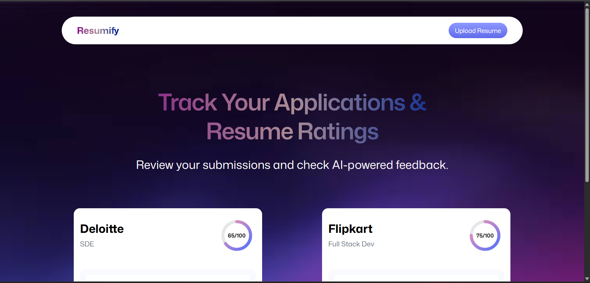

## 📑 Table of Contents

- [Introduction](#introduction)
- [Tech Stack](#tech-stack)
- [Features](#features)
- [Quick Start](#quick-start)

---

## 🧠 Introduction

**Resumify** is an AI-powered resume feedback web application that helps job seekers improve their resumes through automated analysis and real-time visual insights.

Users can upload a resume and receive AI-generated feedback on content quality, skills, formatting, keywords, and ATS (Applicant Tracking System) compatibility. This web app bridges the gap between generic resume templates and industry-optimized documents by providing targeted suggestions and enhancement tips through an interactive review interface.

---

## 🧰 Tech Stack

This project leverages modern web technologies and powerful AI integrations:

- **React (with Remix)**: Used for building a fast, scalable frontend UI with server-side rendering capabilities.
- **Tailwind CSS**: Enables rapid styling with utility-first classes and responsive design out of the box.
- **Puter SDK (File System + Key-Value Store)**: Utilized to store uploaded resumes, feedback, and related data persistently and securely.
- **Custom Image-to-PDF Preview**: Users get a live preview of their uploaded resumes, converted and rendered using blob-based previews.
- **AI-Powered Feedback Engine**: Feedback is generated from AI models and stored per resume for fast retrieval and display in multiple categorized sections.
- **TypeScript**: Ensures type safety across all major data structures, particularly for feedback and resume metadata.

---

## ✨ Features

- Upload PDF resumes and receive real-time visual previews.
- View AI-generated feedback categorized as Summary, ATS Score & Tips, and Detailed Improvements.
- Preview and download resumes directly from the web app.
- Fully responsive design with smooth transitions and animations.
- Secure file and metadata handling using Puter’s SDK.

---

## 📸 Screenshots

### 🔐 Login Page


### 🏠 Home Page  


### 📝 Resume Upload


### 🤖 AI Result


### 📄 Resume Feedback


---

## ⚡ Quick Start

```bash
# 1. Clone the repository
git clone https://github.com/Amol-Singh/resumify.git
cd resumify

# 2. Install dependencies
npm install

# 3. Run the app locally
npm run dev

# 4. Deploy on Puter
puter deploy
